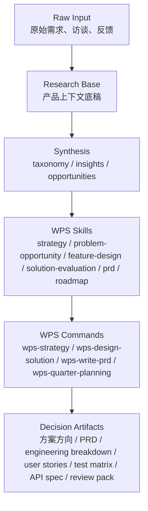

# WPS Skill Map

这份文档把 `WPS 项目管理 / 日事清` 专区中已经建立的研究文件、分析产物、skills、commands 和交付物关系整理成一张“工作地图”。

它的用途不是列目录，而是回答：

- 遇到一个产品问题时，应该先看哪类材料
- 当前仓库里的各类文件之间是什么关系
- 哪些文件是输入，哪些文件是输出
- 从需求分析走到方案和 PRD 的路径是什么

---

## 1. 一张图看全局



最重要的逻辑是：

- `raw-input` 是事实来源
- `research` 是产品上下文底座
- `synthesis` 是从大规模需求数据中提炼出来的分析结果
- `skills` 是单项方法
- `commands` 是完整工作流
- 最终交付物才是能进入评审、排期和开发协同的文档

---

## 2. 文件分层地图

### Layer 1: 原始输入层

这些文件是“事实来源”，不是结论。

#### 原始需求输入

- [`research/wps-project-management/raw-input/WPS项目管理个人版需求聚类分析.md`](/Users/sihuo/workspace/Product-Manager-Skills/research/wps-project-management/raw-input/WPS项目管理个人版需求聚类分析.md)
- [`research/wps-project-management/raw-input/WPS项目管理企业版需求聚类分析.md`](/Users/sihuo/workspace/Product-Manager-Skills/research/wps-project-management/raw-input/WPS项目管理企业版需求聚类分析.md)

它们的作用：

- 提供原始用户表达
- 提供第一层分类
- 为后续结构化和分析提供原始材料

---

### Layer 2: 研究底稿层 `research/wps-project-management/`

这些文件是“产品上下文底座”。

#### 产品定义与战略

- [`00-product-overview.md`](/Users/sihuo/workspace/Product-Manager-Skills/research/wps-project-management/00-product-overview.md)
- [`01-strategy-context.md`](/Users/sihuo/workspace/Product-Manager-Skills/research/wps-project-management/01-strategy-context.md)

#### 用户与场景

- [`02-user-segments.md`](/Users/sihuo/workspace/Product-Manager-Skills/research/wps-project-management/02-user-segments.md)
- [`03-core-scenarios.md`](/Users/sihuo/workspace/Product-Manager-Skills/research/wps-project-management/03-core-scenarios.md)

#### 竞争、指标、历史、边界

- [`04-competitive-landscape.md`](/Users/sihuo/workspace/Product-Manager-Skills/research/wps-project-management/04-competitive-landscape.md)
- [`05-success-metrics.md`](/Users/sihuo/workspace/Product-Manager-Skills/research/wps-project-management/05-success-metrics.md)
- [`06-feature-history.md`](/Users/sihuo/workspace/Product-Manager-Skills/research/wps-project-management/06-feature-history.md)
- [`07-domain-terminology.md`](/Users/sihuo/workspace/Product-Manager-Skills/research/wps-project-management/07-domain-terminology.md)
- [`08-constraints-and-assumptions.md`](/Users/sihuo/workspace/Product-Manager-Skills/research/wps-project-management/08-constraints-and-assumptions.md)

这些文件的作用：

- 为所有 WPS 专属 skill 提供上下文
- 避免每次做方案都从零讲产品是什么
- 约束产品判断不要脱离现实边界

---

### Layer 3: 需求分析与洞察层 `research/wps-project-management/synthesis/`

这一层是把原始需求转成产品判断输入的关键层。

#### 结构化与清洗基础

- [`README.md`](/Users/sihuo/workspace/Product-Manager-Skills/research/wps-project-management/synthesis/README.md)
- [`analysis-field-spec.md`](/Users/sihuo/workspace/Product-Manager-Skills/research/wps-project-management/synthesis/analysis-field-spec.md)
- [`demand-cleaning-summary.md`](/Users/sihuo/workspace/Product-Manager-Skills/research/wps-project-management/synthesis/demand-cleaning-summary.md)

#### 分类、洞察、机会

- [`demand-taxonomy.md`](/Users/sihuo/workspace/Product-Manager-Skills/research/wps-project-management/synthesis/demand-taxonomy.md)
- [`demand-insights-summary.md`](/Users/sihuo/workspace/Product-Manager-Skills/research/wps-project-management/synthesis/demand-insights-summary.md)
- [`top-opportunities.md`](/Users/sihuo/workspace/Product-Manager-Skills/research/wps-project-management/synthesis/top-opportunities.md)

#### 结构化数据输出

- [`wps-demand-master.csv`](/Users/sihuo/workspace/Product-Manager-Skills/research/wps-project-management/synthesis/data/wps-demand-master.csv)
- [`wps-demand-master-profiled.csv`](/Users/sihuo/workspace/Product-Manager-Skills/research/wps-project-management/synthesis/data/wps-demand-master-profiled.csv)
- [`wps-demand-master-valid-only.csv`](/Users/sihuo/workspace/Product-Manager-Skills/research/wps-project-management/synthesis/data/wps-demand-master-valid-only.csv)

这一层的作用：

- 把大规模需求从“原话堆”提升成“问题空间”
- 帮你决定下一步哪个机会值得进入方案设计

---

## 3. WPS Skills 地图

### 战略与机会判断

- [`wps-project-management-strategy`](/Users/sihuo/workspace/Product-Manager-Skills/skills/wps-project-management-strategy/SKILL.md)
  - 用来做战略框定
  - 输入：研究底稿
  - 输出：战略判断

- [`wps-problem-opportunity-map`](/Users/sihuo/workspace/Product-Manager-Skills/skills/wps-problem-opportunity-map/SKILL.md)
  - 用来把需求和反馈提炼成问题空间
  - 输入：需求分析结果
  - 输出：机会地图

### 方案设计与比较

- [`wps-feature-design`](/Users/sihuo/workspace/Product-Manager-Skills/skills/wps-feature-design/SKILL.md)
  - 用来写功能结构骨架
  - 输入：机会定义
  - 输出：设计骨架

- [`wps-solution-evaluation`](/Users/sihuo/workspace/Product-Manager-Skills/skills/wps-solution-evaluation/SKILL.md)
  - 用来比较多个方案
  - 输入：候选方案
  - 输出：推荐方向

### PRD 与路线图

- [`wps-project-management-prd`](/Users/sihuo/workspace/Product-Manager-Skills/skills/wps-project-management-prd/SKILL.md)
  - 用来写 WPS 专属 PRD

- [`wps-quarter-roadmap`](/Users/sihuo/workspace/Product-Manager-Skills/skills/wps-quarter-roadmap/SKILL.md)
  - 用来做季度路线图

---

## 4. WPS Commands 地图

### `/wps-strategy`

- 文件：
  [`commands/wps-strategy.md`](/Users/sihuo/workspace/Product-Manager-Skills/commands/wps-strategy.md)
- 用途：
  从研究底稿走到战略判断
- 典型输入：
  阶段问题、版本选择、must-win 场景、战略冲突

### `/wps-design-solution`

- 文件：
  [`commands/wps-design-solution.md`](/Users/sihuo/workspace/Product-Manager-Skills/commands/wps-design-solution.md)
- 用途：
  从机会走到方案方向
- 典型输入：
  一个高优机会或问题空间

### `/wps-write-prd`

- 文件：
  [`commands/wps-write-prd.md`](/Users/sihuo/workspace/Product-Manager-Skills/commands/wps-write-prd.md)
- 用途：
  从方案走到 PRD
- 典型输入：
  已确认的推荐方案

### `/wps-quarter-planning`

- 文件：
  [`commands/wps-quarter-planning.md`](/Users/sihuo/workspace/Product-Manager-Skills/commands/wps-quarter-planning.md)
- 用途：
  从战略和机会池走到季度 bet sequencing
- 典型输入：
  当前战略重点 + 候选机会 + 约束

---

## 5. 交付物地图

以这次已经跑通的机会为例，最终沉淀出来的交付物包括：

### 方案层

- [`enterprise-execution-visibility-solution-direction.md`](/Users/sihuo/workspace/Product-Manager-Skills/research/wps-project-management/synthesis/enterprise-execution-visibility-solution-direction.md)

### PRD 层

- [`enterprise-execution-visibility-prd.md`](/Users/sihuo/workspace/Product-Manager-Skills/research/wps-project-management/synthesis/enterprise-execution-visibility-prd.md)

### 工程协同层

- [`enterprise-execution-visibility-engineering-breakdown.md`](/Users/sihuo/workspace/Product-Manager-Skills/research/wps-project-management/synthesis/enterprise-execution-visibility-engineering-breakdown.md)
- [`enterprise-execution-visibility-user-stories.md`](/Users/sihuo/workspace/Product-Manager-Skills/research/wps-project-management/synthesis/enterprise-execution-visibility-user-stories.md)
- [`enterprise-execution-visibility-test-matrix.md`](/Users/sihuo/workspace/Product-Manager-Skills/research/wps-project-management/synthesis/enterprise-execution-visibility-test-matrix.md)
- [`enterprise-execution-visibility-api-field-spec.md`](/Users/sihuo/workspace/Product-Manager-Skills/research/wps-project-management/synthesis/enterprise-execution-visibility-api-field-spec.md)

### 评审层

- [`enterprise-execution-visibility-review-pack.md`](/Users/sihuo/workspace/Product-Manager-Skills/research/wps-project-management/synthesis/enterprise-execution-visibility-review-pack.md)

---

## 6. 常见路径图

### 路径 A：从大规模需求到方案

```text
raw-input
  -> synthesis/data
  -> demand-taxonomy
  -> demand-insights-summary
  -> top-opportunities
  -> wps-design-solution
```

### 路径 B：从机会到 PRD

```text
top-opportunities
  -> solution-direction
  -> wps-write-prd
  -> PRD
```

### 路径 C：从 PRD 到研发协同

```text
PRD
  -> engineering-breakdown
  -> user-stories
  -> test-matrix
  -> api-field-spec
  -> review-pack
```

### 路径 D：从战略到底层交付

```text
research base
  -> wps-strategy
  -> quarter-planning
  -> chosen opportunity
  -> design-solution
  -> write-prd
  -> engineering package
```

---

## 7. 文件关系表

| 类型 | 代表文件 | 输入来自哪里 | 输出给哪里 |
| --- | --- | --- | --- |
| 原始输入 | `raw-input/*.md` | 用户需求、访谈、反馈 | `synthesis/data` |
| 研究底稿 | `research/wps-project-management/*.md` | 产品上下文 | WPS skills / commands |
| 分析产物 | `demand-taxonomy` / `insights` / `opportunities` | 结构化需求数据 | 方案设计、战略、路线图 |
| 技能 | `skills/wps-*` | 研究底稿、分析产物 | 单项判断或文档 |
| 工作流 | `commands/wps-*` | 技能 + 上下文 | 完整交付链路 |
| 交付物 | `solution-direction` / `PRD` / `review-pack` | command / skill 输出 | 评审、排期、开发 |

---

## 8. 如何查这张图

如果你以后遇到下面这些问题，可以直接按这张图找：

### “我现在有很多需求，不知道先看什么”

先看：

- [`synthesis/README.md`](/Users/sihuo/workspace/Product-Manager-Skills/research/wps-project-management/synthesis/README.md)
- [`demand-taxonomy.md`](/Users/sihuo/workspace/Product-Manager-Skills/research/wps-project-management/synthesis/demand-taxonomy.md)
- [`demand-insights-summary.md`](/Users/sihuo/workspace/Product-Manager-Skills/research/wps-project-management/synthesis/demand-insights-summary.md)

### “我已经知道一个机会了，想出方案”

先看：

- [`top-opportunities.md`](/Users/sihuo/workspace/Product-Manager-Skills/research/wps-project-management/synthesis/top-opportunities.md)
- 再用：
  [`wps-design-solution`](/Users/sihuo/workspace/Product-Manager-Skills/commands/wps-design-solution.md)

### “我要写 PRD”

先看：

- 该机会对应的 `solution-direction`
- 再用：
  [`wps-write-prd`](/Users/sihuo/workspace/Product-Manager-Skills/commands/wps-write-prd.md)

### “我要拉研发和测试一起对齐”

直接看：

- `engineering-breakdown`
- `user-stories`
- `test-matrix`
- `api-field-spec`
- `review-pack`

---

## 9. 推荐入口

如果你是第一次看 WPS 专区，建议从这里开始：

- 使用说明：
  [`WPS PM Operating Guide.md`](/Users/sihuo/workspace/Product-Manager-Skills/docs/WPS%20PM%20Operating%20Guide.md)
- 端到端流程：
  [`WPS Demand-to-Decision Workflow.md`](/Users/sihuo/workspace/Product-Manager-Skills/docs/WPS%20Demand-to-Decision%20Workflow.md)
- 当前这张关系地图：
  [`WPS Skill Map.md`](/Users/sihuo/workspace/Product-Manager-Skills/docs/WPS%20Skill%20Map.md)

---

## 10. 下一步建议

这张地图已经足够支持后续复用。

如果继续完善，下一步最值得做的是：

1. 在 WPS PM Operating Guide 中把这张地图作为“入口导航”
2. 再跑通第二个高优机会，例如：
   - 企业版任务拆解与分工协作
3. 当第二条机会也跑完后，再把两条链路总结成“企业版能力地图”
